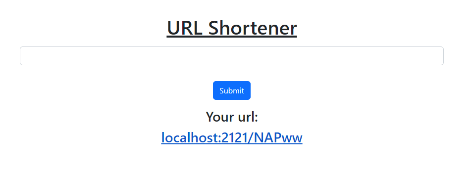

# Link Shortener

This is a simple, easy to use link shortener. Just input a URL and hit submit and you will be given a (hopefully) shorter link!


## Screenshots




## Run Locally

Clone the project

```bash
  git clone https://github.com/JukemJ/url-shortener.git
```

Go to the project directory

```bash
  cd url-shortener
```

Install dependencies

```bash
  npm install
```

Start the server

```bash
  npm server.js
```

